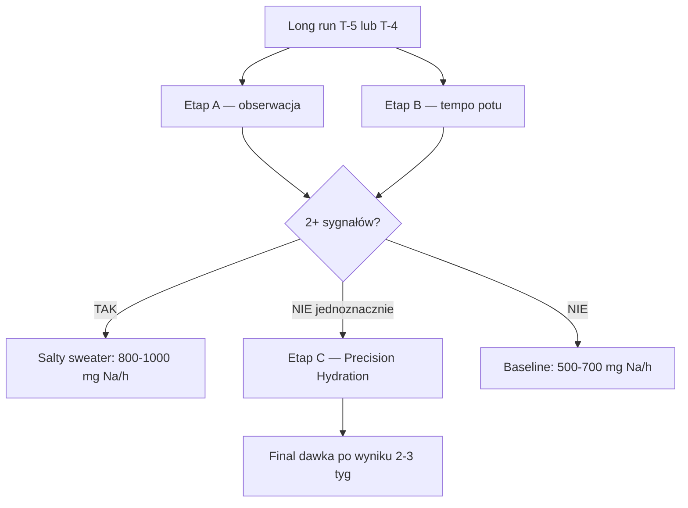

# Salty sweater test — metoda domowa

> **TL;DR:** 3-etapowa metoda do rozstrzygnięcia dawki sodu (300 vs 800 mg/h) bez laboratorium. **Etap A i B** zrobić w ciągu 2 tygodni (do T-3). Etap C opcjonalny, jeśli A+B niejednoznaczne.

## Po co ten test

Plan dawkowania sodu (patrz [[Nawodnienie i sód]]) ma rozrzut:
- **Baseline (15–18°C):** 500–700 mg/h
- **Cieple lub salty sweater:** 700–1000 mg/h

Różnica między 500 a 1000 mg/h przez 24h = **12 g sodu** różnicy. To kluczowa kalibracja, bo:
- Za mało sodu → [[70-Ryzyko/EAH hiponatremia|EAH]] (jeśli dużo wody) lub skurcze
- Za dużo sodu → osmotyczna biegunka, GI distress

## Etap A — obserwacja subiektywna (koszt 0)

Po dłuższym treningu (90+ min, ciepło):

| Sygnał | Co znaczy |
|--------|-----------|
| **Białe plamy/linie soli** na czarnym trykocie | Wysokie prawdopodobieństwo salty sweater |
| **Pieczenie oczu** od własnego potu | Wysoki Na |
| **Słony smak potu z warg** | Wysoki Na |
| **Skóra po biegu pokryta chrupiącym „nalotem"** | Wysoki Na |

**Interpretacja:** 2+ pozytywne sygnały → prawdopodobnie salty sweater → cel sodu **800–1000 mg/h** baseline.

## Etap B — tempo potu (koszt 0, do zrobienia przed T-3)

**Kiedy:** podczas long runa T-5 lub T-4. Trening 60–90 min, dzień ~18°C, brak deszczu.

**Procedura:**

1. **Zważ się nago rano**, po opróżnieniu pęcherza → **W_przed**
2. **Trening** 60–90 min, **znana ilość wypitych płynów** (np. 500 ml = 0,5 kg)
   - Brak korzystania z toalety, brak prysznica
   - Strój zostaw na sobie i ważysz przed/po dla precyzji (ale standard: nago)
3. **Po treningu osusz ręcznikiem**, zważ nago → **W_po**
4. **Oblicz:**
   ```
   Utrata potu [kg/h] = (W_przed - W_po + wypite[kg]) / godziny treningu
   ```

**Interpretacja:**

| Utrata potu | Interpretacja | Wskazówka Na |
|-------------|---------------|--------------|
| <0,5 L/h | Niska | Niski Na, baseline 400 mg/h wystarczy |
| **0,5–1,2 L/h** | Norma dla 64 kg | **Baseline 500–700 mg/h** |
| >1,2 L/h | Wysoka | **700–1000 mg/h, salty sweater prawdopodobny** |
| >1,5 L/h | Bardzo wysoka | **Etap C konieczny** |

## Etap C — pomiar sodium (opcjonalny, 150–350 zł)

**Tylko jeśli A+B niejednoznaczne lub wysokie wskaźniki.**

| Test | Koszt | Dokładność | Dostępność PL |
|------|-------|------------|---------------|
| **Precision Fuel & Hydration Advanced Sweat Test** | ~350 zł | Lab-grade ±5% | Sklepy triatlonowe PL lub UK wysyłka |
| MX3 Hydration Tester | ~200 zł | ±15% od lab | Słaba |
| Gx Sweat Patch (Gatorade) | ~150 zł | ±15% | Bardzo słaba |

**Rekomendacja:** Precision Hydration jeśli budżet pozwala — wynik w 2–3 tyg., wtedy **końcowa dawka Na/h**.

## Plan działania



## Co zapisuje Marcin po teście

W [[60-Support/Dziennik supportera]] (lub osobnym notesie):
- Data, temperatura, wilgotność
- W_przed, W_po, wypite, czas treningu
- Sygnały subiektywne (białe linie? pieczenie oczu? smak słony?)
- Obliczona utrata potu
- Decyzja o dawce Na/h

## Powiązania

- **Nawodnienie i sód — protokół** → [[Nawodnienie i sód]]
- **Fueling w biegu** → [[Fueling w biegu]]
- **EAH ryzyko** → [[70-Ryzyko/EAH hiponatremia]]
